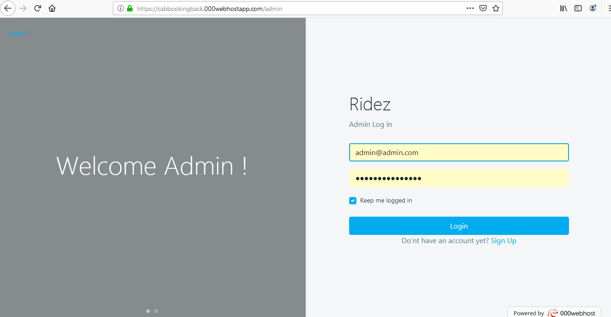
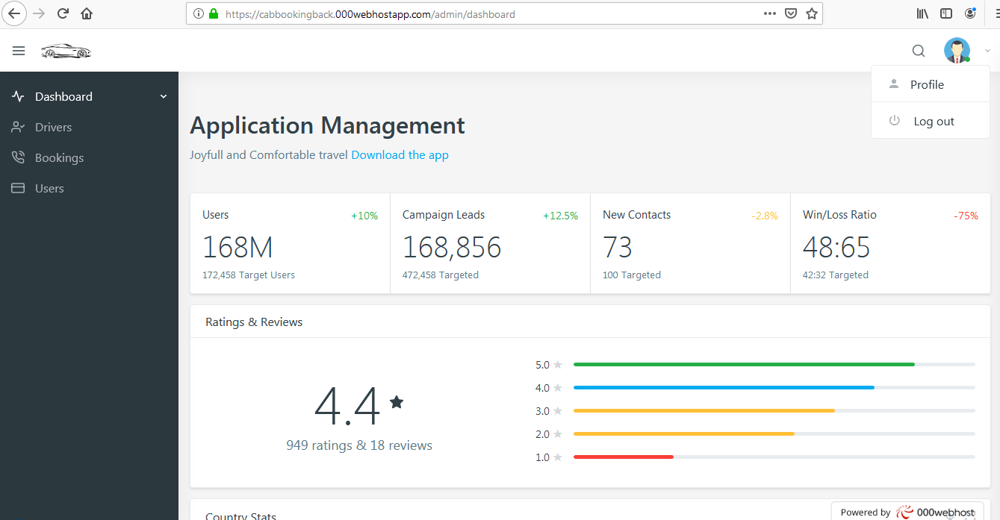
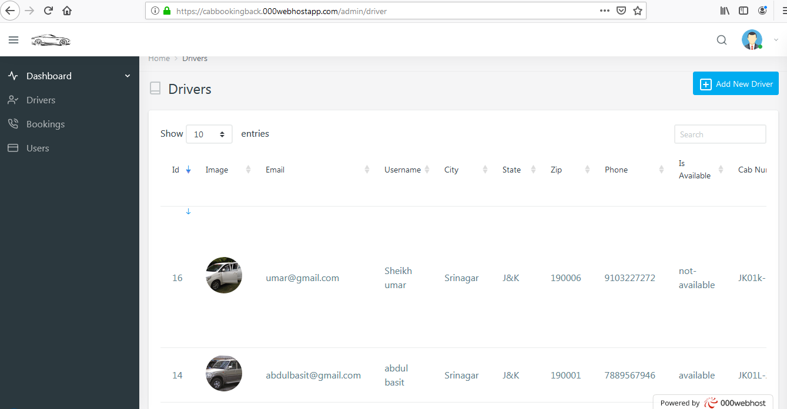
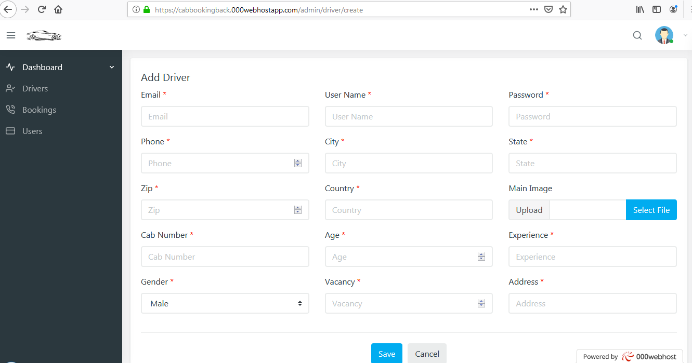
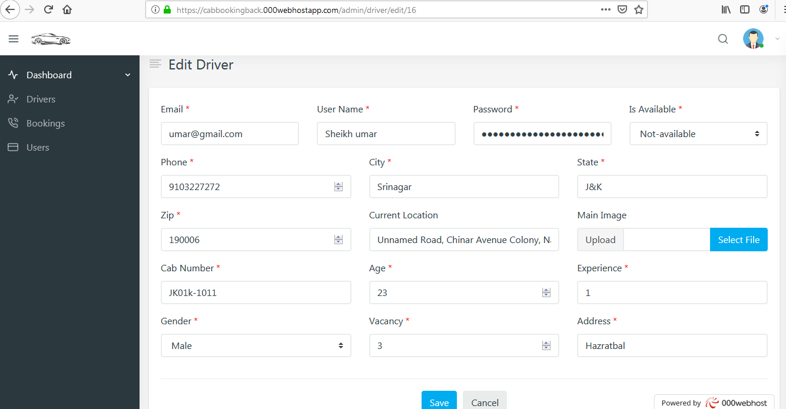
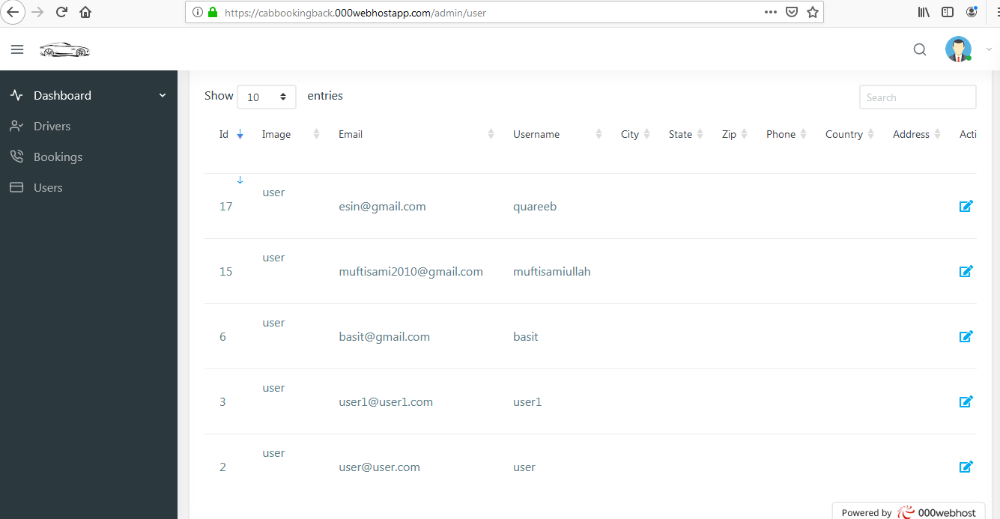
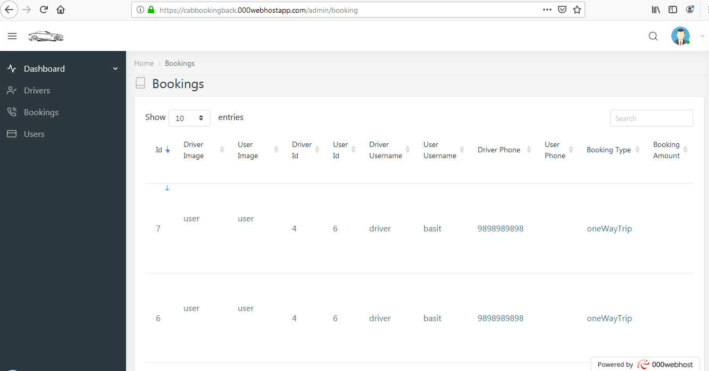
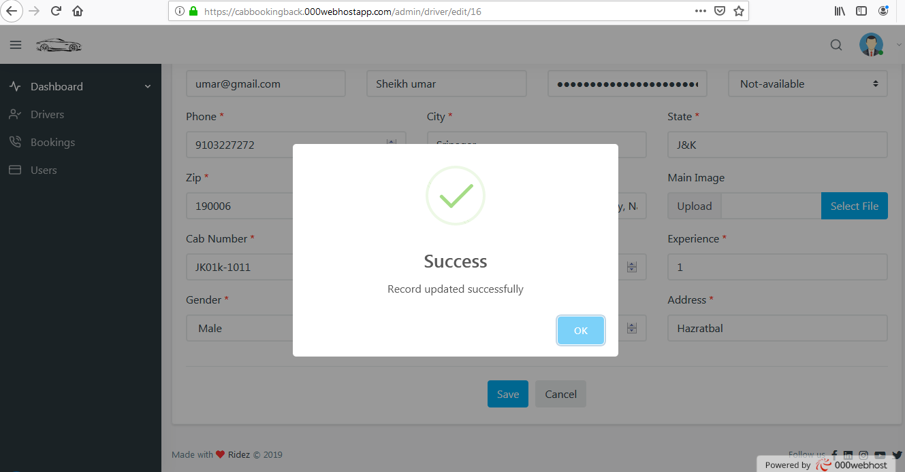
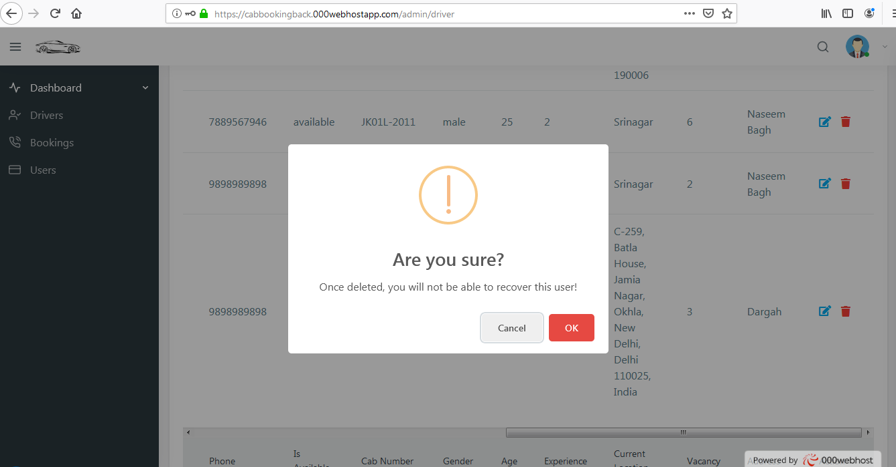

# RideZ 
Joyfull and Comfortable travel 
<a href="https://www.dropbox.com/s/8iireeb52o4tmkt/RIDEz.apk?dl=0">DOWNLOAD THE APP</a> 
FRONT END : FLUTTER  
BACK END : LARAVEL 
<h4>To test the app</h4> 
UserLogin credentials :  

 UserName : basit@gmail.com 
    PassWord : basit@gmail.com

 DriverLogin credentials :  

 UserName : driver@driver.com 
    PassWord : driver@driver.com
 
<h4>To get the application code email me or leave a message</h4> 
# cab_booking_backend
This is the backend using LARAVEL for https://github.com/basitmir/cab_booking  
<h3>Vist : <a href="https://cabbookingback.000webhostapp.com/admin">Cab booking Backend</a>  
#Here are the screen shots of the web Application  

 
  
  
  

  
 
 
 
 
 

